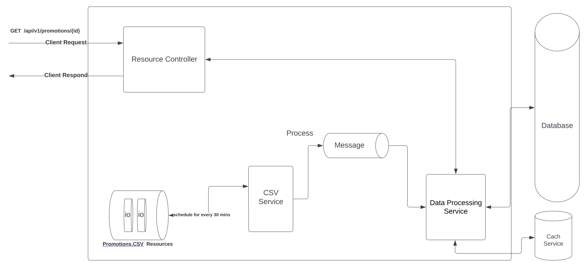

# Storage Problem

#### Big Picture

In this diagram, the CSV files are ingested by a CSVService, which reads the files and sends the data to a message queue, such as Kafka or RabbitMQ. The message queue provides a scalable and fault-tolerant way to store the data and distribute it to multiple downstream services.

**CSVService** is responsible to read every 30 mins from the IO. Regarding the reading file we have to consider read the file with **BufferedReader** and avoiding to load all file at the same time into the memory. Obviously, in the meantime we handle **FileLock** the **FileChannel** when we starting the process.

The data is then consumed by a **DataProcessingService**, which reads the data from the message queue, processes it, and stores it in a database, such as PostgreSQL, or Cassandra. The **DataProcessingService** can also perform any necessary data validation, enrichment, transformation, or even caching mechanism.

Once the data is stored in the database, it can be accessed by an API service, which provides an endpoint for clients to query the data. The API Service/ResourceController can be implemented using a web framework, such as Spring, Express, and can handle authentication, authorization, and rate limiting.

To handle concurrency issues, such as read/write conflicts, the database can be configured with appropriate locking mechanisms, such as row-level locking or optimistic locking. Additionally, the message queue can be configured with appropriate delivery semantics, such as at-least-once or exactly-once, to ensure that messages are not lost or duplicated.

Finally, to ensure the reliability and scalability of the system, it should be deployed using a container orchestration platform, such as Kubernetes or Docker Swarm, and monitored using a logging and monitoring platform, such as ELK or Prometheus.

Of course, this is just one example of a possible architecture design, and the actual design would depend on the specific requirements and constraints of the system.

---

### DB details:

There are several reasons why **PostgreSQL** could be a good choice for this architecture:

- ACID compliance: PostgreSQL is ACID-compliant, which means it provides a high level of data consistency, reliability, and durability. This is important for ensuring data integrity, especially when handling large volumes of data.
- Flexibility: supports a wide range of data types, including JSON and XML, which makes them suitable for handling different types of data. They also support various programming languages and frameworks, making it easy to integrate them with other architecture components.
- Performance: PostgreSQL is optimized for fast read and write operations, and supports various indexing and caching mechanisms to improve query performance.
- Scalability: designed to scale horizontally and vertically, which means it can handle large amounts of data and traffic. They can also be clustered and shared to distribute the workload across multiple nodes.

**Cassandra** is a popular NoSQL database that is designed to handle large amounts of unstructured or semi-structured data, making it a good choice for handling big data workloads. Here are some reasons why Cassandra could be a good choice for this architecture:

- Tunable consistency: allows you to configure the consistency level of your read and write operations, which can help balance performance and data consistency requirements.
- Scalability: is designed to scale horizontally, which means it can handle large volumes of data and traffic. It can also be distributed across multiple nodes to ensure high availability and fault tolerance.
- Flexible data model: Cassandra's data model is highly flexible, which means it can handle different types of data and data structures. This can be especially useful when dealing with data that doesn't fit neatly into a traditional relational database schema.
- High write throughput: Cassandra is optimized for fast write operations, which makes it ideal for handling large volumes of incoming data.

However, there are some trade-offs to consider when using Cassandra. For example, its data model can be more complex than traditional relational databases, which can make querying and reporting more challenging. Additionally, it may require more expertise to administer and maintain, especially in distributed environments.

---

### Message Queue Details:

Kafka and RabbitMQ are both popular message brokers that can be used in a microservices architecture to decouple components and enable asynchronous communication between them.

- Asynchronous communication: they allow components to communicate asynchronously, which means that components can send messages to one another without having to wait for a response. This can help improve overall system performance and resilience.
- Scalability: Kafka and RabbitMQ are designed to handle large volumes of messages and can be scaled horizontally to handle increasing amounts of traffic. They can also be clustered to ensure high availability and fault tolerance.
- Flexibility: they support a wide range of messaging patterns, including publish-subscribe, point-to-point, and request-response. This makes them suitable for a wide range of use cases.
- Data persistence: Kafka and RabbitMQ can be configured to persist messages to disk, which means that messages can be stored and retrieved even if a component goes down or is temporarily unavailable.

Consider, they can add additional complexity to the system and require additional configuration and maintenance.

---

To handle millions of requests per minute, we would need to design the system with scalability and performance in mind that are some possible strategies for handling high levels of traffic:

- Caching: To improve response times and reduce the load on the database, we could use a caching layer such as Redis or Memcached to store frequently accessed data.
- Load balancing: To distribute incoming requests evenly across multiple instances of the application, we could use a load balancer such as NGINX or Amazon ELB.
- Horizontal scaling: To handle increasing levels of traffic, we could scale out the application horizontally by adding more instances of the application and/or database servers.
- Monitoring and alerting: To detect and respond to performance issues in real-time, we could use tools such as Prometheus and Grafana to monitor system metrics and trigger alerts when thresholds are exceeded.
- Asynchronous processing: To reduce the impact of long-running operations on the application's responsiveness, we could use asynchronous processing to handle tasks such as CSV ingestion and database writes.
